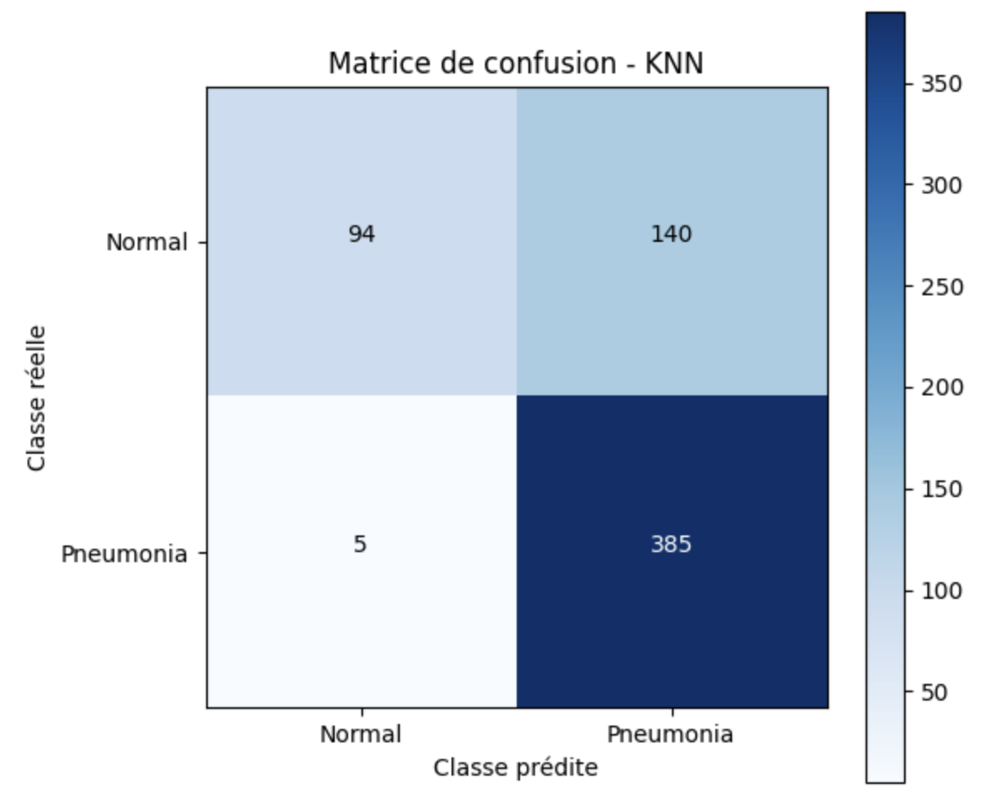
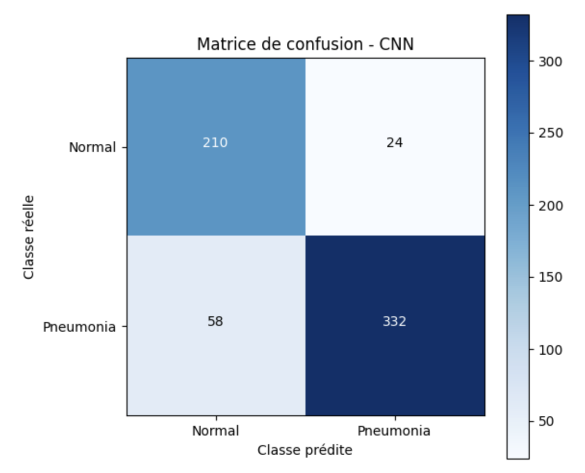
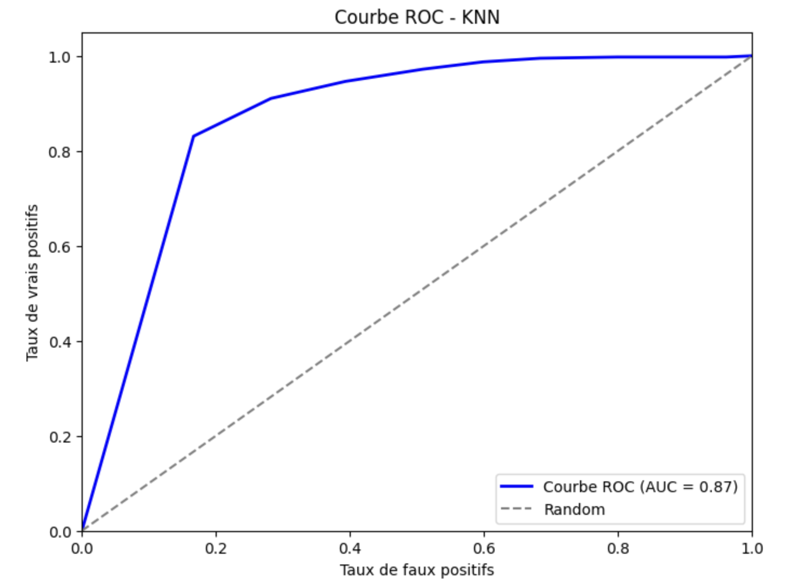
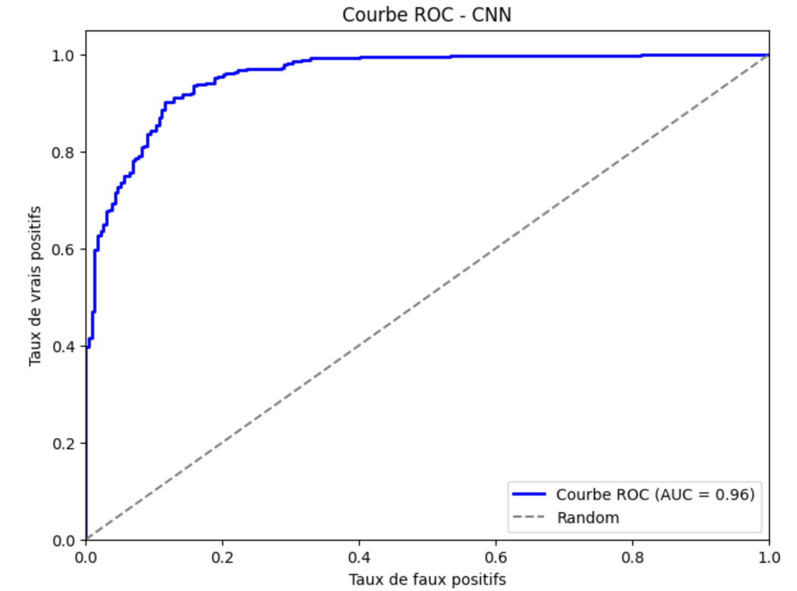

# 🩺 Détection de la Pneumonie avec KNN & CNN

## 📌 Introduction

### **Contexte**
La pneumonie est une infection pulmonaire grave qui peut être mortelle si elle n'est pas diagnostiquée à temps. L'analyse des radiographies thoraciques permet d'identifier cette maladie, mais l'interprétation humaine peut être subjective et chronophage. Ce projet vise à automatiser la détection de la pneumonie à l'aide de modèles de Machine Learning.

Nous avons comparé deux approches :
✔️ **K-Nearest Neighbors (KNN)** – Un modèle basé sur la proximité des points dans un espace de caractéristiques.
✔️ **Convolutional Neural Network (CNN)** – Un modèle de Deep Learning spécialisé dans l'analyse des images.

L'objectif est d'identifier l'approche la plus performante pour classifier les radiographies en **NORMAL** ou **PNEUMONIA**.

---

## 📌 Jeu de Données et Prétraitement

### **Présentation du Jeu de Données**
Le jeu de données utilisé contient des radiographies pulmonaires classées en deux catégories :

- **Normal (poumons sains)**
- **Pneumonia (poumons infectés)**

### **Distribution des Données**
| Ensemble | Images Normales | Images Pneumonie | Total |
|----------|----------------|------------------|-------|
| **Entraînement** | 1 341 | 3 875 | 5 216 |
| **Test** | 234 | 390 | 624 |

### **Pipeline de Prétraitement**
1. **Conversion en niveaux de gris** pour réduire la complexité.
2. **Redimensionnement** des images en `64x64` pixels pour uniformiser les entrées.
3. **Normalisation** des valeurs de pixels entre `[0,1]` pour une meilleure stabilité numérique.
4. **Extraction de caractéristiques** :
   - **KNN** : Conversion des images en vecteurs 1D aplatis.
   - **CNN** : Conservation du format 2D avec un seul canal (grayscale).

---

## 📌 Modèle 1 : K-Nearest Neighbors (KNN)

### **Architecture du Modèle**
- **Extraction de caractéristiques** : Réduction de dimension via PCA (50 composantes).
- **Métrique de distance** : Manhattan (`L1 Norm`).
- **Optimisation des hyperparamètres** : Recherche des meilleurs `k` et poids avec GridSearchCV.

📌 **Meilleurs paramètres trouvés :**
```
{'knn__metric': 'manhattan', 'knn__n_neighbors': 7, 'knn__weights': 'distance', 'pca__n_components': 50}
```

### **Résultats KNN**
```
Exactitude (Accuracy) : 77,40 %
F1-Score : 75 %
```
| Classe | Précision | Rappel | F1-Score | Support |
|--------|----------|--------|----------|---------|
| **Normal** | 0.94 | 0.42 | 0.58 | 234 |
| **Pneumonie** | 0.74 | 0.98 | 0.84 | 390 |

🔍 **Observations :**
✔️ KNN fonctionne correctement mais est sensible au déséquilibre des classes.
✔️ L'extraction de caractéristiques avec PCA améliore l'efficacité.
❌ Sensible au bruit dans les données à haute dimension.

---

## 📌 Modèle 2 : Réseau de Neurones Convolutifs (CNN)

### **Architecture du CNN**
| Couche | Type | Filtres | Taille du noyau | Activation |
|--------|------|---------|----------------|------------|
| **Entrée** | Convolutionnelle | 32 | (3,3) | ReLU |
| | MaxPooling | - | (2,2) | - |
| | Convolutionnelle | 64 | (3,3) | ReLU |
| | MaxPooling | - | (2,2) | - |
| | Convolutionnelle | 128 | (3,3) | ReLU |
| | MaxPooling | - | (2,2) | - |
| | Convolutionnelle | 256 | (3,3) | ReLU |
| | MaxPooling | - | (2,2) | - |
| | Flatten | - | - | - |
| | Dense | 512 | - | ReLU |
| | Dropout | - | - | 0.5 |
| | Dense | 256 | - | ReLU |
| | Dropout | - | - | 0.3 |
| **Sortie** | Dense | 1 | - | Sigmoïde |

### **Résultats CNN**
```
Exactitude (Accuracy) : 86,54 %
F1-Score : 87 %
```
| Classe | Précision | Rappel | F1-Score | Support |
|--------|----------|--------|----------|---------|
| **Normal** | 0.80 | 0.85 | 0.82 | 234 |
| **Pneumonie** | 0.90 | 0.88 | 0.89 | 390 |

🔍 **Observations :**
✔️ CNN surpasse KNN en termes de précision et de rappel.
✔️ Capable de détecter la pneumonie avec une grande fiabilité.
✔️ L'ajout de Dropout améliore la généralisation.

---

## 📌 Évaluation et Visualisation

### **Matrices de Confusion**
#### 🔍 **KNN**


#### 🔍 **CNN**


### **Courbes ROC & Scores AUC**
#### 🔍 **KNN**


#### 🔍 **CNN**


🔍 **Analyse des Résultats :**
✔️ **Le CNN atteint une AUC plus élevée**, indiquant une meilleure séparation des classes.
✔️ **KNN présente un taux d'erreur plus élevé**, particulièrement sur les images normales.
✔️ **Le CNN équilibre bien la sensibilité et la spécificité.**

---

## 📌 Conclusion & Perspectives d'Amélioration

### **Principaux Enseignements**
✔️ Le **CNN** est nettement plus performant que le **KNN** pour la détection de la pneumonie.
✔️ L'extraction de caractéristiques améliore la robustesse du KNN.
✔️ Les modèles de Deep Learning sont mieux adaptés aux images médicales complexes.


